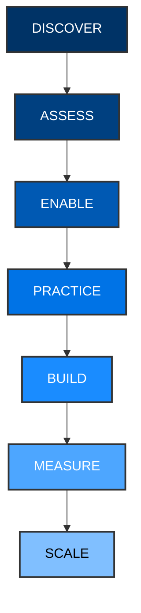

# Implementation Roadmap & AI Champions Program

## Visual Roadmap

### Phase Details
1. **DISCOVER:** Understand departments, roles, existing tools, and AI maturity.
2. **ASSESS:** Measure current AI knowledge through baseline scoring.
3. **ENABLE:** Train employees through modular workshops and labs.
4. **PRACTICE:** Apply learnings to real PRP use cases (e.g., CPaaS proposals, SMS campaigns).
5. **BUILD:** Execute Capstone projects (e.g., Support Copilot).
6. **MEASURE:** Track adoption, time saved, and outcomes against the KPI framework.
7. **SCALE:** Create internal AI champions to drive long-term value.

---

## The PRP AI Champions Network

To ensure the training translates into permanent cultural change, we recommend establishing the **PRP AI Champions Network**.

### Who are AI Champions?
Selected high-performing employees from different departments (Sales, Tech, Support, Marketing) who show high aptitude during the training.

### Responsibilities:
- Help their respective teams adopt new AI workflows.
- Identify new automation opportunities within daily operations.
- Share best practices and successful prompts across departments.
- Build and prototype internal use cases.
- Support responsible AI usage and report compliance issues.
- Coordinate with leadership to track ROI.

### Organizational Framework:
- **Management Sponsor:** Provides executive backing and budget for tools.
- **Training Team:** Provides initial enablement and ongoing advanced resources.
- **Department Leads:** Set departmental goals for the AI Champions to solve.
- **AI Champions:** Execute the on-the-ground automation and peer support.
